# 0.7. Temas Individuales por Integrante (Informes)

## Informe sobre el trabajo de IoT services

# Proyecto IoT con Azure y ESP32

## Parte Conceptual

### Internet

Internet es un gran conjunto de redes interconectadas. Lo que lo diferencia de otros tipos de redes es que es una red distribuida; esto significa que no depende de una máquina principal. Mientras dos máquinas puedan enviar y transmitir datos a través de los protocolos correctos, pueden pertenecer al Internet.  
*(Cloudflare - cap. 1, s.f.)*

La comunicación en Internet se realiza mediante paquetes, que dividen un mensaje en segmentos y hacen uso de protocolos para su correcta creación y transmisión.  
*(Cloudflare - cap. 3, s.f.)*

Para que una computadora se conecte a Internet, necesita dispositivos físicos. Los más comunes en hogares son:
- **Router**: permite conexiones físicas e inalámbricas.
- **Módem**: conecta dispositivos de una red a Internet.
- **Switch**: permite únicamente conexiones físicas.  
*(Cloudflare - cap. 4, s.f.)*

---

### Paquetes

Los paquetes permiten enviar y recibir mensajes al ser almacenados en pequeños segmentos de datos. Generalmente, cada paquete tiene:
- Una **cabecera**: contiene origen, destino e información de control.
- Una **carga útil**: contiene los datos reales.

Los protocolos como IP y TCP son los responsables de generar esta información.

Internet usa un sistema llamado packet switching, que permite procesar paquetes de forma independiente. Sin este método, no podría existir el internet moderno, ya que solo se permitirían comunicaciones entre una máquina a otra.  
*(Cloudflare, s.f.)*

---

### Protocolos

Los protocolos son un conjunto de reglas que permiten el formateo y procesamiento de datos. Son necesarios para que computadoras con diferentes sistemas operativos se comuniquen sin incompatibilidades.

Protocolos más comunes:
- **IP**: permite el enrutamiento y redireccionamiento de datos.
- **ICMP**: envía reportes de errores y del estado de la conexión.
- **TCP**: asegura el envío correcto de datos.
- **HTTPS**: permite que la data sea presentada en formatos directamente utilizables (ej. videos en redes sociales).
- **UDP**: alternativa rápida al TCP, pero menos confiable.  
*(Cloudflare, s.f.)*

---

###  IoT (Internet of Things)

El Internet de las Cosas se refiere a una red de dispositivos físicos que poseen sensores, programas y conexión a redes para permitirles transmitir datos.  
Su característica principal es la conectividad, ya que requieren de una red para funcionar y reportar sus datos.  
*(IBM)*

---

###  Soluciones IoT

Son programas que permiten la conexión de dispositivos IoT para la obtención y análisis de datos. Estas soluciones:
- Permiten recolección y análisis continuo.
- Brindan conexión perpetua y confiable.
- Ayudan a reducir costos y tiempos mediante acceso remoto.  
*(Enertiv, s.f.)*

---

### SAS Token

Un SAS Token es una cadena de autenticación que permite el acceso a un recurso (como Azure IoT) por medio de un bróker MQTT o endpoint HTTP, por un tiempo limitado, sin compartir directamente la clave secreta.  
*(Microsoft)*

---

### Protocolo MQTT
MQTT (Message Queuing Telemetry Transport) es un protocolo ligero de mensajería basado en el modelo publicación-suscripción. Esta diseñado para permitirle el funcionamiento a equipos con recursos de computación limitados, como los sistemas de IoT. 

Este funciona como un intermediario que permite que los publicadores puedan conectarse a un suscriptor para poder enviar un mensaje. Los suscriptores pueden ser servicios cloud, una red del hogar, entre otros; mientras que los publicadores son todos los dispositivos que pueden conectarse a red.

---

## Consideraciones Técnicas

Las soluciones IoT pueden apoyar tanto a empresas como a personas comunes.

### Caso de uso:

- **Azure IoT** fue seleccionado por su facilidad de uso y por ofrecer $200 de crédito gratuito.
- El dispositivo será un sensor de temperatura y humedad (DHT11), útil para que padres monitoreen si el ambiente es apto para bebés.

### Componentes del proyecto:

- **ESP32**: comunicará los datos al software IoT.
- **Cables macho-macho**: brindan electricidad.
- **Protoboard**: permite conexiones físicas.
- **Sensor DHT11**: mide temperatura y humedad.
- **Cable micro-USB**: energiza el ESP32.
- **Librerías**: necesarias para el SAS Token.

---

## Pasos para iniciar en Azure IoT

1. Ingresar a **Resource Groups** en Azure.
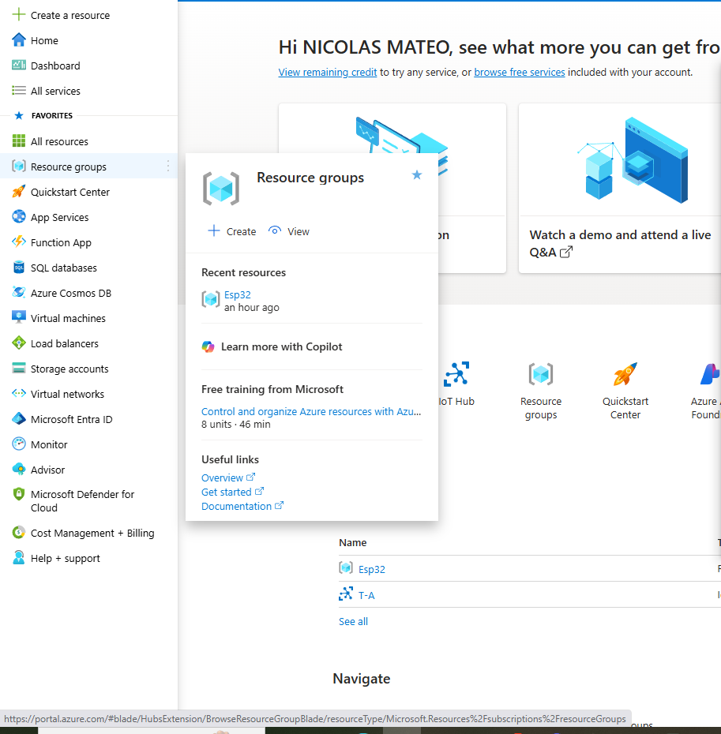
2. Crear un nuevo **Resource Group**.
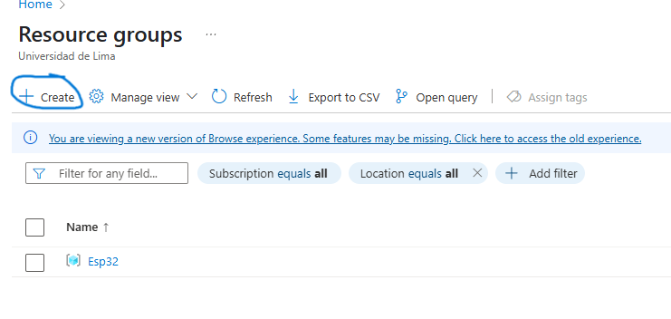
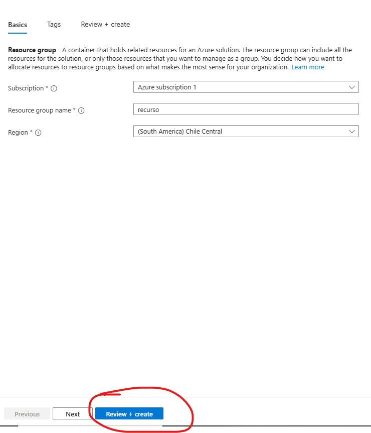
3. Buscar `IoT Hub` y hacer clic en **crear**.
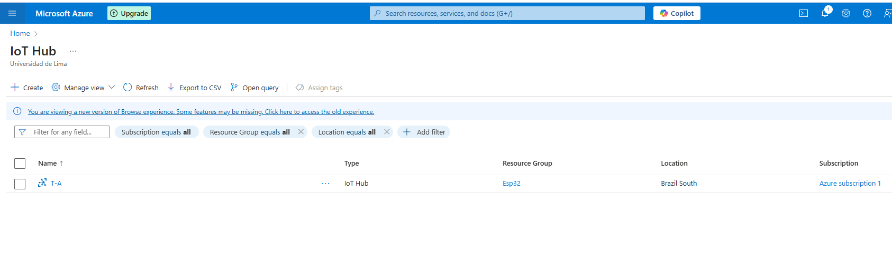
4. Asociarlo al grupo creado.
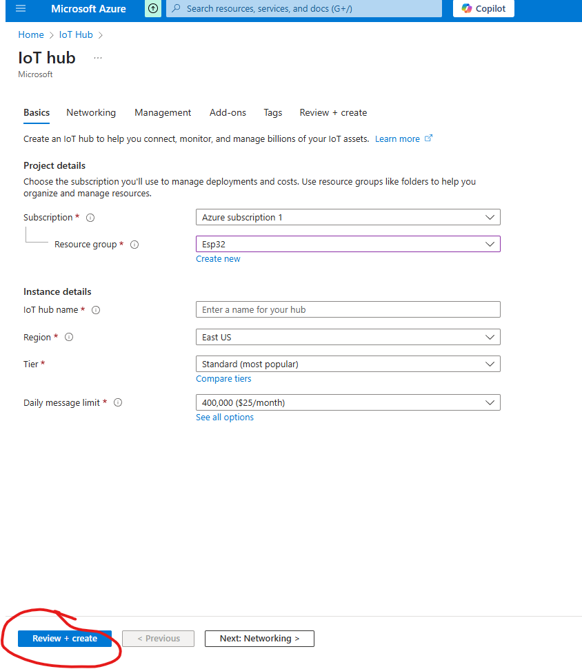
5. Entrar al nuevo IoT Hub y copiar el **hostname**.
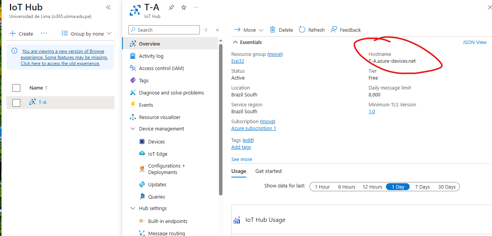
6. Ir al menú y luego a `Devices` > **Add Device**.
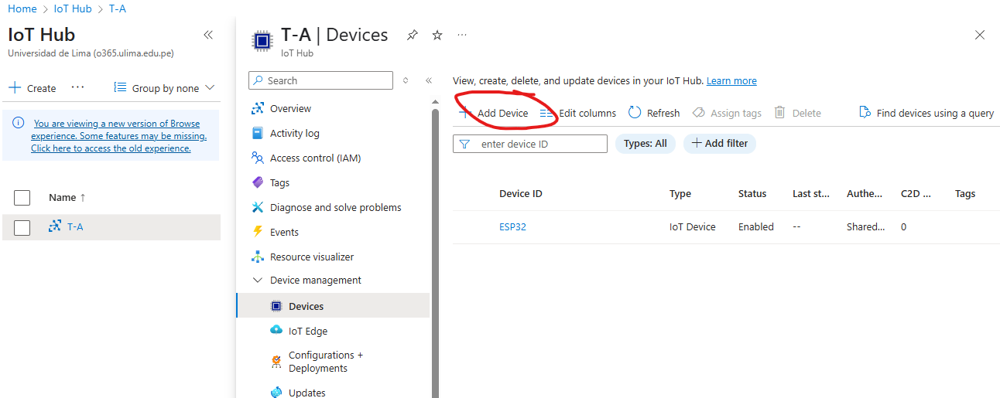
7. Nombrarlo "ESP32", usar claves simétricas y habilitarlo.
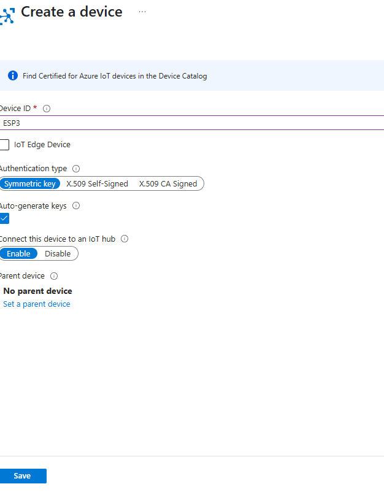
8. Copiar el **ID del equipo** y la **clave primaria**.
-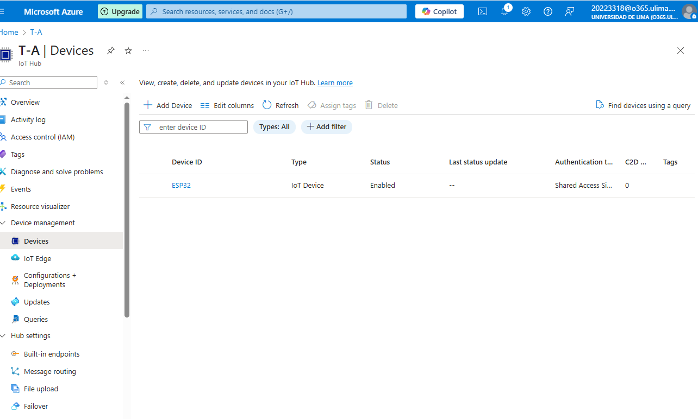
-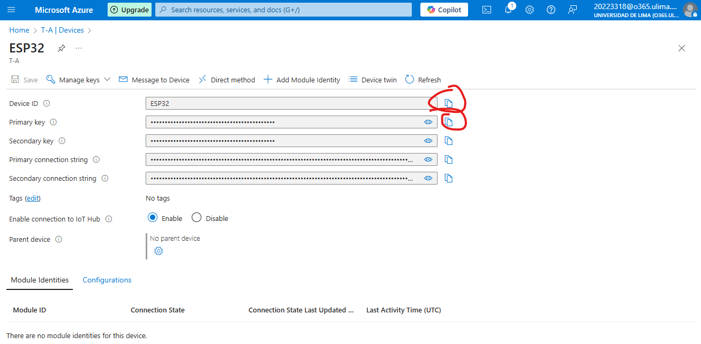
---

## Construcción del dispositivo IoT

La estructura física:
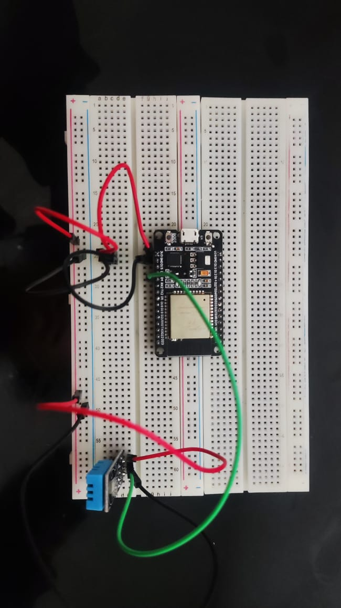
- El **ESP32** se conecta a la **protoboard** con cables rojo (Vcc) y negro (GND).
- El **sensor DHT11** se conecta al pin digital 4 del ESP32 con un cable verde.
- Se alimenta al DHT11 también con rojo y negro desde el protoboard.
---

## Configuración del entorno de desarrollo

1. Descargar e instalar el **IDE de Arduino**.

2. Conectar el ESP32 a la PC.
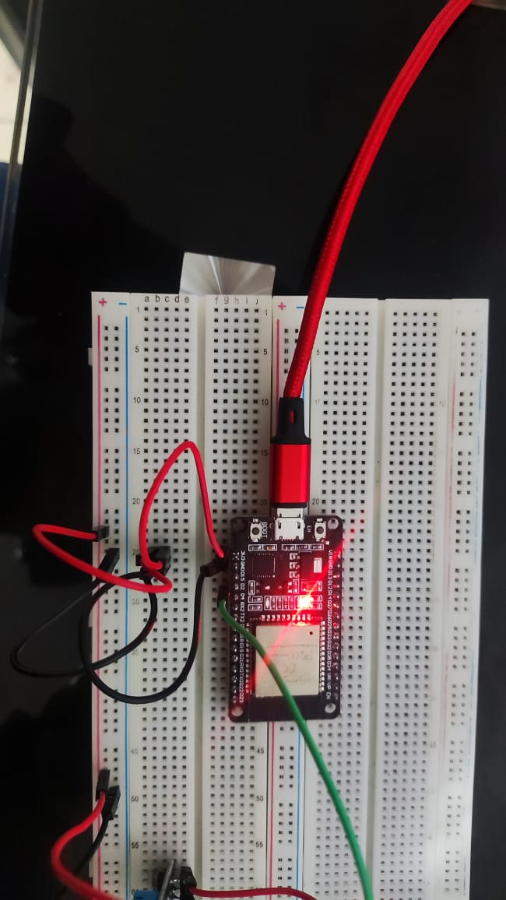
3. Instalar el controlador **CP2102 USB-to-Serial Bridge**:

   - Descargar ZIP.
    

   - Descomprimirlo y ejecutar `x64` o `x86` según la arquitectura de tu PC.
    

4. Abrir Arduino IDE:

   - Instalar librerías: **DHT kxn**, **Azure SDK for C**. 
     

   - Entrar a la selección de placas.
    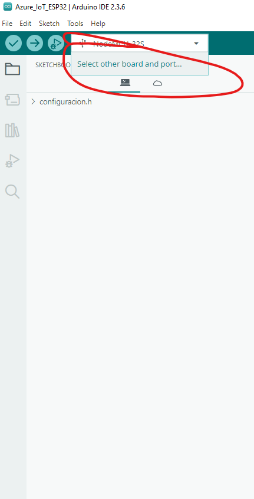

   - Escoger la placa (ej. `NodeMCU-32S`) y el puerto (ej. COM3 USB) respectivo.
    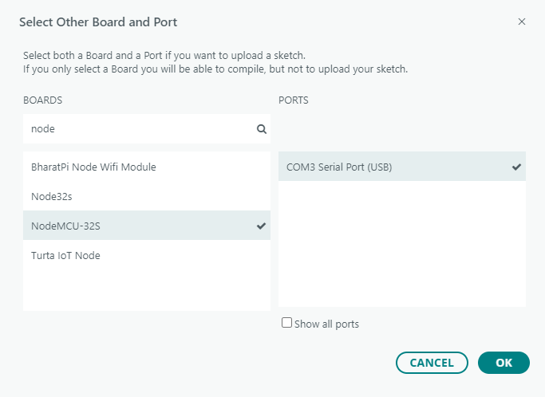
---

## Archivos utilizados

Desde el repositorio de GitHub de [EhabMagdyy](https://github.com/EhabMagdyy/Azure_IoT_ESP32):

- `AzIoTSasToken.cpp`
- `AzIoTSasToken.h`
- `SerialLogger.cpp`
- `SerialLogger.h`
- `iot_configs.h`

Además, crear un archivo `.ino` con el código del ESP32 (este se llamará `Trabajo.ino` en este caso) para conectarse a Azure y enviarle datos. A continuación explicaré que hace cada archivo

### iot_configs.h

Su función es la de brindar los datos de conexión al servicio, previamente copiados de azure, y de conectividad un router al archivo

Las variables para los primeros son HOSTNAME para el hostname de Azure, DEVICE_ID para el id del dispositivo y DEVICE_KEY para la llave primaria del dispositivo.

### SerialLogger.cpp
Esta permite que nuestro dispositivo posea una coordinación de tiempo exacta al de Azure para mantener los logs del equipo en el mismo tiempo que los del servicio, usa time.h para lograrlo.

### SerialLogger.h
Permite que cada código usado para la coordinación de tiempo sea importado y brinda el ratio en el que nuestro ESP32 puede enviar datos (**SERIAL_LOGGER_BAUD_RATE**).

### AzIoTSasToken.cpp
Genera el token SAS para que el dispositivo pueda conectarse a Azure. A continuación explicaré las funciones involucradas en su creación.

- La primera, **AzIoTSasToken::AzIoTSasToken()** se llama para definirlo.

- Luego se llama a **AzIoTSasToken::Generate()** para crearlo. Dentro de esta se ejecutan **iot_sample_get_epoch_expiration_time_from_minutes()** para obtener su tiempo de expiración y  **az_iot_hub_client_sas_get_signature()** para crear la firma de verificación del token.

- Dentro **az_iot_hub_client_sas_get_signature()** se ejecutan **decode_base64_bytes()** para obtener la clave decodificada de base64 de Azure, **hmac_sha256_sign_signature()** para crear la encriptación SHA-256 del SAS token (durante su ejecución se ejecuta  **mbedtls_hmac_sha256()** para usar HMAC con SHA-256) y, finalmente, ejecuta **base64_encode_bytes()** para codificarlo en base64.

- Continua con la creación del token final con **az_iot_hub_client_sas_get_password()**.

Las funciones que permiten saber los datos más importantes son **getSasTokenExpiration()** para saber su tiempo de expiración y **Get()** para obtener el token.

### AzIoTSasToken.h
Permite que las funciones de `AzIoTSasToken.cpp` sean importadas a `Trabajo.ino`.

---

## Explicación del código

Primero explicaré que permite cada import en una tabla

| Librería                     | Función                                                 |
| ---------------------------- | ------------------------------------------------------- |
| `#include <WiFi.h>`          | Permite que el ESP32 se conecte a Wifi|
| `#include <mqtt_client.h>`   | Obtenemos el broker MQTT para la comunicación IoT      |
| `#include "DHT.h"`           | Obtiene las funciones de los dispositivos DHT        |
| `#include <az_core.h>`       | Núcleo del SDK de Azure.                                |
| `#include <az_iot.h>`        | Funciones IoT Hub del SDK Azure.                        |
| `#include "AzIoTSasToken.h"` | Genera los SAS token           |
| `#include "SerialLogger.h"`  | Funciones para la coordinación de logs con Azure|
| `#include "iot_configs.h"`   | Configuración para la conexión de Azure con Internet       |
| `#include "azure_ca.h"`      | Da el certificadoraíz de Azure para TLS.                     |

Luego lo que realiza cada función

- **void connectWiFi()**
Configura el ESP32 como cliente WiFi (WIFI_STA) y usa la información de red para conectarse a internet dentro de iot_configs.

- **void setupTime()**
Sincroniza el tiempo al formato de Azure

- **void initializeIoTHub()**
Permite que se conecte a Azure por medio de MQTT. Usa la información de Azure en iot_confis para tener los datos de la conexión

- **mqttEventHandler()**
Llama a los eventos MQTT para conectarse o mostrar datos.

-  **initMqttClient()**
Genera un SAS Token, de duración de 60 minutos, usando **AzIoTSasToken**.  También configura el cliente MQTT para conectarse con TLS a Azure

- **void sendTelemetry()**
Genera la telemetría MQTT para conectarse a **az_iot_hub_client_telemetry_get_publish_topic()**. También da la información que se debe mostrar en Azure.

- **void setup()**
Genera el llamado previo de todas las funciones anteriores para la creación de los elementos que permitirán la conexión. También obtenemos el tiempo que pase desde el tiempo de encendido del ESP32 con **millis()**

- **void loop()**
Es lo que se mantendrá ejecutando durante los momentos que el ESP32 se mantenga activo. Primero se verificará que se esté conectado a internet, la verificación para enviar datos sincronizados y el tiempo de espera que tiene para su ejecución.

**Diagrama de flujo de las funciones**
    A[Inicio del sistema - setup()] --> B[Conexión a WiFi - connectWiFi()]
    B --> C[Sincronización del tiempo - setupTime()]
    C --> D[Inicialización de Azure IoT Hub - initializeIoTHub()]
    D --> E[Inicialización del cliente MQTT - initMqttClient()]
    E --> F[Inicio del sensor DHT11]
    F --> G[loop()]
    G --> H{WiFi conectado?}
    H -- No --> B
    H -- Sí --> I{Tiempo de enviar datos?}
    I -- No --> G
    I -- Sí --> J[Lectura de sensor DHT]
    J --> K{Datos válidos?}
    K -- No --> G
    K -- Sí --> L[Envío de Telemetría - sendTelemetry()]
    L --> G

## Subir y ejecutar

1. Guardar todos los archivos usados dentro de una carpeta.
    
2. Verificar y subir el código al ESP32.
    -
    -

---
## Revisión de datos
Los datos no se pueden ver de forma accesible en Azure IoT, para esto existe una aplicación que muestra estos mensajes.

1. Instalar **Azure IoT Explorer** desde su [GitHub oficial](https://github.com/Azure/azure-iot-explorer).

2. Abrir y hacer clic en **Add connection**.

3. Ahora para configurar el dispositivo en Azure IoT Explorer:
   - Ir a `Shared access policies`.
    
   - Copiar el **Primary connection string** del `iothubowner`.
    
   - Pegar en Azure IoT Explorer y guardar.
    

4. Nos redirigimos al menú y entramos a nuestra conección:

5. Hacemos click en nuestro **dispositivo**:    
 
6. Ir a **Telemetry** y hacer clic en **Start**.
 

Ahora se verán los datos en tiempo real.
 

Para detener el envío de datos, simplemente desconecta el ESP32. Se pueden cerrar todos los programas que tenemos abiertos sin problemas a perjudicar su funcionamiento.

---

## Referencias

- [Cloudflare - What is a packet?](https://www.cloudflare.com/learning/network-layer/what-is-a-packet/)
- [Cloudflare - Internet Protocol](https://www.cloudflare.com/learning/network-layer/internet-protocol/)
- [Cloudflare - What is a protocol?](https://www.cloudflare.com/learning/network-layer/what-is-a-protocol/)
- [Enertiv - What are IoT solutions?](https://www.enertiv.com/resources/faq/what-are-iot-solutions)
- [GitHub - Azure IoT ESP32 (EhabMagdyy)](https://github.com/EhabMagdyy/Azure_IoT_ESP32/tree/main)
- [IBM - Internet of Things](https://www.ibm.com/think/topics/internet-of-things)
- [Microsoft - Crear SAS Tokens](https://learn.microsoft.com/es-es/azure/ai-services/translator/document-translation/how-to-guides/create-sas-tokens?tabs=Containers)
- [Microsoft - Información general sobre la característica MQTT broker de Azure Event Grid](https://learn.microsoft.com/es-es/azure/event-grid/mqtt-overview)
