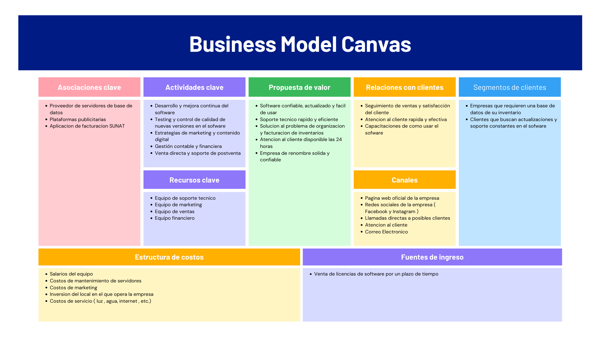
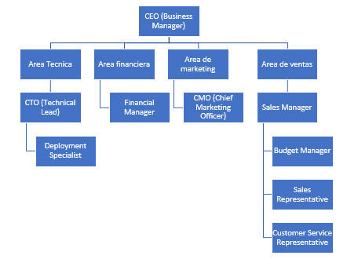

# Generalidades
Descripción de la empresa:
La empresa Aventix fue fundada el 2013 por los ingenieros Victor Ballena y Nicola Champa, dos ingenieros de sistemas con mas de 20 años de experiencia. La empresa esta enfocada en brindar una solución a las empresas que no cuentan con una base de datos flexible y fácil de usar. Ademas mediante esta base de datos se puede hacer facturación directa a la entidad de la Sunat. Operamos principalmente con la venta de la licencia del sofware; la instalación y capacitación del mismo es por vía online. En los últimos años nos hemos consolidado como una de las mejores empresas con el mejor sofware de inventarios, con este renonbre hemos hecho alianzas con varias empresas tecnológicas como Google.

# Módulos principales del sistema

**Módulo de almacenamiento:**
Contiene los datos más importantes del negocio y permite su posterior modificación

**Módulo de facturacion electronica:**
Permite a los usuarios emitir facturas, boletas y notas de crédito; cumpliendo con las normativas vigentes en el proceso.

**Módulo de gestion de inventario:**
Administra el stock de productos, controla ingresos y salidas de mercaderia y genera alertas de reposicion automatica

**Módulo de CRM basico:**
Centraliza informacion basica de los clientes, su historial de compras y genera comunicaciones automaticas como recordatorios de pago

**Módulo de Configuración:**
Gestiona usuarios, roles y permisos de acceso, asegurando la integridad de los datos y protegiendo la información empresarial. Además, lanza nuevas actualizaciones del sistema.

**Módulo de Seguridad:**
Implementa medidas de seguridad al sistema.

# Modelo de negocio

# Estructura del equipo

# Stakeholders

| **Nombre** | **Cargo**                          | **Rol Catálogo**         | **Interés**                       | 
|-------------------------|---------------------------------------|---------------------------------|----------------------|
|Marco Rivera|	CEO|	Business Manager |	Acceso conjunto a la información del negocio |
|Mario Salcedo|	CTO	| Technical Lead |	Que los aspectos del negocio tengan una mejor coordinación entre ellos |
|Jorge Ramos|	Ingeniero DevOps|	Deployment Specialist | Que hayan mayores facilidades para su despliegue |
|Juan Pereira	|Contador	|Financial Manager|	Que las facturas tenga una mayor simplicidad en su creación y almacenadas dentro de un lugar en conjunto |
|Jacinta Quispe |	Jefe de marketing	| Chief Marketing Officer	| Que los  |
|Julian Alvarez	|Gerente Comercial |	Sales Manager	|Analiza datos de ventas, tendencias de clientes, reportes.|
|Eduardo Gonzales|	Administrador de Presupuestos	|Budget Manager|	Controla y proyecta presupuestos de la empresa|
|Martin Pinedo|	Ejecutivos de Ventas|	Sales Representative|	Se encargan directamente de buscar y cerrar ventas|
|Micaela Rosas|	Asesora de servicios postventa|	Customer Service Representative|	Se encarga de brindar apoyo post-venta|

